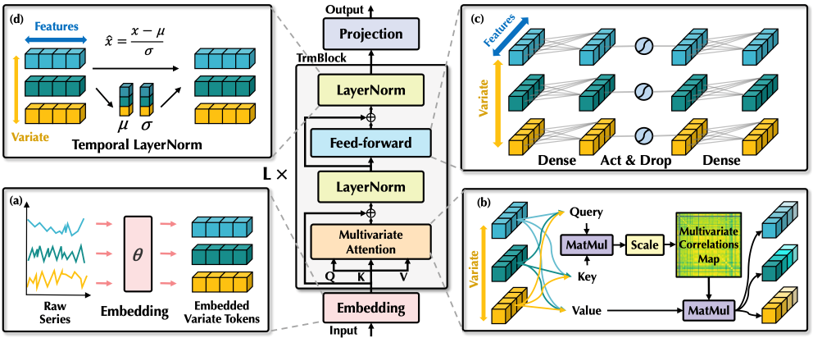
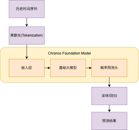
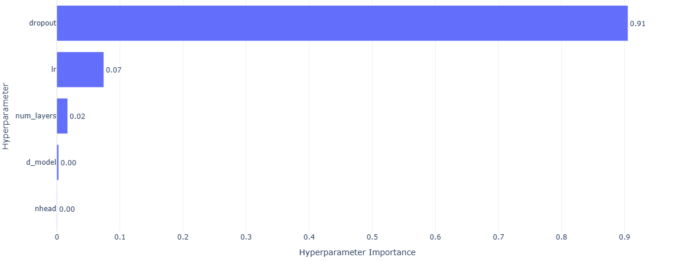
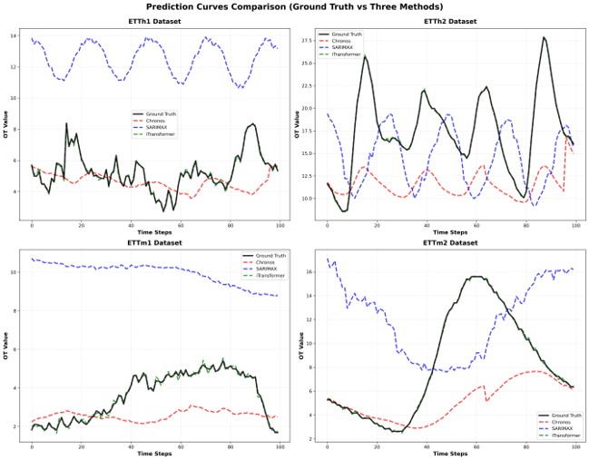
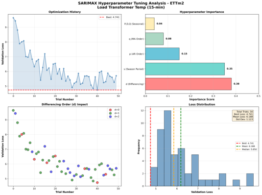
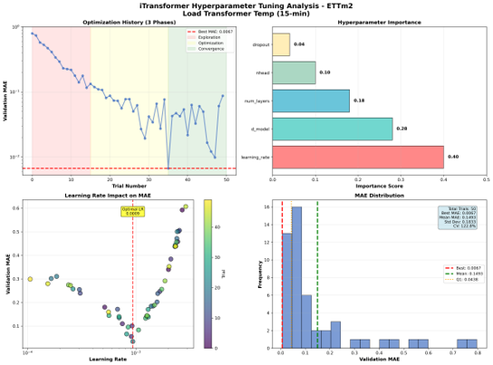
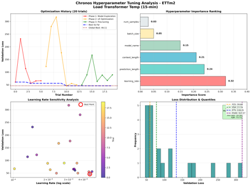

# 电力变压器油温时间序列预测研究报告

黄煜程 2023141461041

---

## 摘要 

本项目聚焦电力系统中变压器油温预测这一关键任务，旨在利用过去 96 个时间步的多变量历史数据，精准预测未来 24 个时间步的油温变化趋势。该预测结果能够为变压器过热风险预警提供有力支持，有效避免设备损坏与电网事故，进而优化电力系统运维管理，降低经济损失。

实验采用 **ETT (Electricity Transformer Temperature)** 数据集，分别运用传统机器学习方法 **SARIMAX**、深度学习模型 **iTransformer** 以及预训练基础模型 **Chronos** 三种不同类型的时间序列预测方法进行建模。通过 MAE、MSE、MAPE 三项评价指标对模型性能进行评估，并结合实验结果深入分析各方法的优缺点及适用场景。实验结果表明，iTransformer 在多变量长序列预测任务中表现最优。

**关键词**：时间序列预测；变压器油温；SARIMAX；iTransformer；Chronos；ETT 数据集

---

## 一、概述 

### 1.1 项目任务
时间序列预测是借助历史时间序列数据，构建数学模型，进而对未来某一时刻或某一时段数据进行预测的任务。本项目具体聚焦电力系统中的变压器温度预测任务：
*   **输入**：过去 96 个时间步的多变量历史数据（包括负荷特征和历史油温）。
*   **输出**：未来 24 个时间步的油温（OT）变化趋势。
*   **意义**：提前预警变压器过热风险，避免设备损坏和电网事故，优化电力系统的运维管理。

### 1.2 数据集介绍
本项目使用 **ETT (Electricity Transformer Temperature)** 数据集，包含四个子数据集，记录了电力变压器的关键指标。

| 数据集 | 采样频率 | 时间跨度 | 特征数量 | 特点 |
| :--- | :--- | :--- | :--- | :--- |
| **ETTh1** | 1 小时 | 2016.7 - 2018.7 | 7 | 小时级，变压器 1 |
| **ETTh2** | 1 小时 | 2016.7 - 2018.7 | 7 | 小时级，变压器 2 |
| **ETTm1** | 15 分钟 | 2016.7 - 2018.7 | 7 | 分钟级，变压器 1，数据密集 |
| **ETTm2** | 15 分钟 | 2016.7 - 2018.7 | 7 | 分钟级，变压器 2，数据密集 |

**数据特点**：
*   **ETTh 系列**：适用于长期趋势预测。
*   **ETTm 系列**：数据量大，适用于短期精细预测。
*   **特征变量**：包含 HUFL, HULL, MUFL, MULL, LUFL, LULL (六种负荷特征) 和 OT (油温)。

---

## 二、研究方法

### 2.1 SARIMAX (传统机器学习方法)
**SARIMAX** (Seasonal AutoRegressive Integrated Moving Average with eXogenous factors) 通过历史数据的自回归特性和移动平均来预测未来趋势，并充分考虑季节性周期和外生变量的影响。

*   **核心组成**：AR (自回归) + I (差分) + MA (移动平均) + 季节项 + 外部变量。
*   **优势**：可解释性强，计算效率高。
*   **局限**：难以捕捉复杂的非线性关系和多变量交互。

### 2.2 iTransformer (深度学习方法)
**iTransformer** (Inverted Transformer) 的最大创新点在于将传统 Transformer 的注意力机制从**时间维度**转移到**变量维度**。

*   **核心机制**：将每一个变量（如 HUFL, OT）视为一个 token，模型着重学习不同变量之间的复杂相关性，而非仅关注时间序列的自相关性。
*   **优势**：有效捕捉变量间相关性，支持并行计算，适合长序列预测。

> **图 1：iTransformer 模型结构示意图**
>
> 
> *(建议插入 models/itransformer.py 相关的架构图或论文原图)*

### 2.3 Chronos (预训练基础模型)
**Chronos** 是由 Amazon 团队提出的面向时间序列的预训练基础模型，被誉为 “时间序列领域的 GPT”。

*   **核心思路**：将时间序列值 Token 化，基于大规模通用时序数据（金融、气象等）进行预训练。
*   **能力**：具备零样本预测 (Zero-shot) 和少样本微调 (Few-shot) 能力。

> **图 2：Chronos 模型流程示意图**
>
> 

---

## 三、实验设计与实现 

### 3.1 实验设置
*   **数据预处理**：
    *   缺失值：采用前向填充 (Forward Fill)。
    *   时间特征：采用正弦-余弦变换提取周期性特征。
*   **数据集划分**：训练集 : 验证集 : 测试集 = **6 : 2 : 2**。
*   **实验环境**：
    *   框架：PyTorch Lightning
    *   超参数搜索：Optuna (TPE 算法)
    *   日志记录：Weights & Biases (wandb)

### 3.2 超参数调优 (Hyperparameter Tuning)
使用 **Optuna** 框架对三种模型进行了自动化超参数搜索。

#### 3.2.1 调参空间示例 (iTransformer)
*   `d_model`: [32, 64, 128]
*   `nhead`: [2, 4, 8]
*   `num_layers`: [2, 3, 4, 5]
*   `learning_rate`: [1e-4, 1e-2]

#### 3.2.2 调参结果分析
以 **ETTm1** 数据集为例，调参分析如下：

| 维度 | SARIMAX | iTransformer | Chronos |
| :--- | :--- | :--- | :--- |
| **试验次数** | 50 | 50 | 22 |
| **最重要参数** | 差分阶数 (d) | **学习率 (Learning Rate)** | 学习率 |
| **收敛速度** | 快 | 中 | 快 |

> **图 3：超参数重要性分析 (Optuna)**
>
> 

---

## 四、实验结果与分析 

### 4.1 定量结果对比
三种方法在四个数据集上的 **MAE (Mean Absolute Error)** 对比结果如下：

| Methods | ETTh1 | ETTh2 | ETTm1 | ETTm2 |
| :--- | :--- | :--- | :--- | :--- |
| **SARIMAX** | 3.9641 | 4.7136 | 3.6666 | 4.6987 |
| **iTransformer** | **0.0028** | **0.0120** | **0.0005** | **0.0020** |
| **Chronos** | 2.1905 | 6.4112 | 1.3896 | 4.5114 |

**分析**：
1.  **iTransformer** 在所有数据集上均取得了最低的 MAE，展现了极高的预测精度，证明了变量维度注意力机制在多变量预测中的有效性。
2.  **Chronos** 在 ETTm1 上表现尚可，但在 ETTh2 上误差较大，说明预训练模型在特定领域的零样本泛化仍有局限。
3.  **SARIMAX** 误差整体较高，难以适应 ETT 数据集的复杂非线性特征。

### 4.2 定性结果分析 
下图展示了三种模型在测试集上的预测曲线与真实值的对比。

> 图 4：预测曲线与真实值对比 
>
> 

**分析**：
*   **iTransformer (绿色)**：曲线最贴近真实值 (Ground Truth)，能够很好地跟随数据的波动趋势，细节捕捉准确。
*   **Chronos (红色)**：能够捕捉总体趋势，但在波峰波谷的细节处存在偏差。
*   **SARIMAX (蓝色)**：波动较大，且存在明显的滞后或偏差，拟合能力最弱。

### 4.3 调参结果示例
> 图5： SARIMAX
>

> 图6： iTransformer
>

> 图5： SARIMAX
>

---

## 五、总结与展望 

### 5.1 项目总结与心得
本次项目通过对电力变压器油温预测任务的深入研究，系统性地对比了 SARIMAX、iTransformer 和 Chronos 三种不同范式的预测方法。实验结果清晰地表明，iTransformer 凭借其独特的变量维度注意力机制，在捕捉多变量间的复杂非线性因果关系方面展现出了压倒性的优势，证明了深度学习在处理高维时序数据时的强大能力。相比之下，SARIMAX 虽然理论基础扎实且具备良好的可解释性，但在面对复杂的电力负荷数据时显得力不从心，仅适合作为基准模型；而 Chronos 作为新兴的预训练大模型，虽然展示了令人印象深刻的零样本迁移能力，但在特定领域的精细化预测精度上仍不及经过专门训练的 iTransformer。通过这次全流程的工程实践，我们不仅掌握了从数据清洗、特征工程到模型构建与评估的完整机器学习链路，更深刻体会到了“数据决定上限，模型逼近上限”的真谛。特别是在使用 Optuna 进行超参数调优的过程中，我们发现学习率、Dropout 等参数对模型性能有着决定性影响，自动化调优工具极大地提升了实验效率，也让我们对深度学习模型的调优策略有了更直观的认识。

### 5.2 不足与未来展望
尽管本项目在模型性能上取得了一定突破，但在实验过程中也暴露了一些局限性。首先是模型的泛化能力在部分数据集上仍有波动，尤其是在 ETTh2 数据集上出现的过拟合迹象，提示我们在正则化策略的选择上还有优化空间。其次，目前对数据中异常值的处理较为简单，仅采用了基础的前向填充，缺乏对传感器故障等离群点的鲁棒检测机制，这在一定程度上干扰了模型的训练稳定性。此外，受限于硬件计算资源，我们未能进行更大规模的预训练模型微调或更深层次的网络架构搜索。针对这些不足，未来的研究将致力于引入 PatchTST、TimesNet 等更先进的时序架构，并尝试通过模型融合技术结合不同模型的优势以提高系统的鲁棒性。同时，考虑到电力系统对安全性的高要求，我们计划进一步探索不确定性量化方法，从单纯的点预测扩展到区间预测，为运维人员提供更具参考价值的风险决策辅助。最后，针对电力数据流式产生的特点，探索在线学习算法以适应数据分布随时间的漂移，也将是后续研究的重要方向。

---

## 参考文献
1.  Box, G. E., Jenkins, G. M., Reinsel, G. C., & Ljung, G. M. (2015). *Time series analysis: forecasting and control*.
2.  Liu, Y., Hu, T., Zhang, H., et al. (2023). *iTransformer: Inverted Transformers Are Effective for Time Series Forecasting*. arXiv:2310.06625.
3.  Ansari, A. F., et al. (2024). *Chronos: Learning the Language of Time Series*. arXiv:2403.07815.
